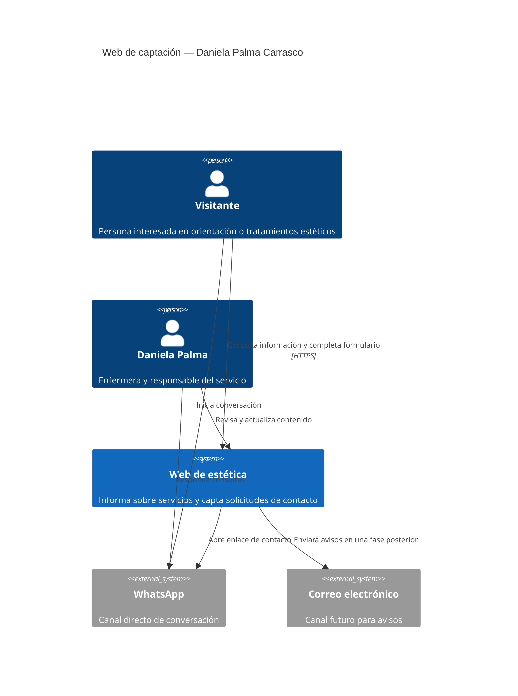

# C1 — Diagrama de contexto

```mermaid
C4Context
  title Web de captación — Daniela Palma Carrasco
  Person(visitor, "Visitante", "Persona interesada en orientación o tratamientos estéticos")
  Person(daniela, "Daniela Palma", "Enfermera y responsable del servicio")
  System(site, "Web de estética", "Informa sobre servicios y capta solicitudes de contacto")
  System_Ext(whatsapp, "WhatsApp", "Canal directo de conversación")
  System_Ext(email, "Correo electrónico", "Canal futuro para avisos")
  Rel(visitor, site, "Consulta información y completa formulario", "HTTPS")
  Rel(visitor, whatsapp, "Inicia conversación")
  Rel(site, whatsapp, "Abre enlace de contacto")
  Rel(site, email, "Enviará avisos en una fase posterior")
  Rel(daniela, whatsapp, "Responde consultas")
  Rel(daniela, site, "Revisa y actualiza contenido")
```

La primera versión es informativa; el formulario no persiste datos y WhatsApp es el canal externo disponible.

