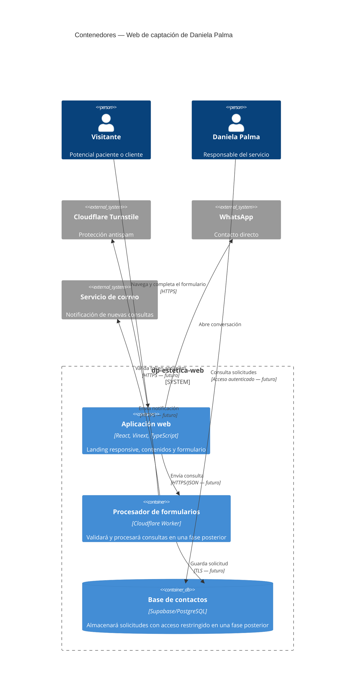

# C2 — Diagrama de contenedores

```mermaid
C4Container
  title Contenedores — Web de captación de Daniela Palma
  Person(visitor, "Visitante", "Potencial paciente o cliente")
  Person(daniela, "Daniela Palma", "Responsable del servicio")
  System_Boundary(system, "dp-estetica-web") {
    Container(web, "Aplicación web", "React, Vinext, TypeScript", "Landing responsive, contenidos y formulario")
    Container(api, "Procesador de formularios", "Cloudflare Worker", "Validará y procesará consultas en una fase posterior")
    ContainerDb(leads, "Base de contactos", "Supabase/PostgreSQL", "Almacenará solicitudes con acceso restringido en una fase posterior")
  }
  System_Ext(turnstile, "Cloudflare Turnstile", "Protección antispam")
  System_Ext(whatsapp, "WhatsApp", "Contacto directo")
  System_Ext(email, "Servicio de correo", "Notificación de nuevas consultas")
  Rel(visitor, web, "Navega y completa el formulario", "HTTPS")
  Rel(web, whatsapp, "Abre conversación")
  Rel(web, api, "Envía consulta", "HTTPS/JSON — futuro")
  Rel(api, turnstile, "Valida token antispam", "HTTPS — futuro")
  Rel(api, leads, "Guarda solicitud", "TLS — futuro")
  Rel(api, email, "Envía notificación", "HTTPS — futuro")
  Rel(daniela, leads, "Consulta solicitudes", "Acceso autenticado — futuro")
```

Los datos clínicos sensibles no se solicitarán en el formulario público.

